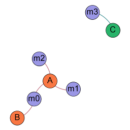

= culturegraph-clustering
:TOC:

A implementation of the graph clustering method used in culturegraph.

The input problem is encoded as a bipartite input graph.
A cluster is defined as a connected component in this input graph.

A bipartite graph __G(U,V)__ is represented by two node sets (namely __U__ and __V__).
We represent the bipartite graph with an adjacency list, that lists all
children for each parent (assuming a digraph).

Although the used bipartite graph is undirected, we refer to the node set __U__ with __"Parent Node Set"__ and
to the node set __V__ with __"Child Node Set"__.

== Installation

=== Requirements

- Java 8 or later

=== Build

image::https://jitpack.io/v/eberhardtj/culturegraph-clustering.svg[link="https://jitpack.io/#eberhardtj/culturegraph-clustering"]

Run the following command to construct a jar with dependencies.

----
gradlew test fatJar
----

== Command Line Client

=== Example

The input file describes a adjacency list, where each line starts with a parent node, followed by its child nodes.
Parent and child nodes belong to distinct sets of nodes that only share connections between each other.

The file `graph.txt` represent a graph as a adjacency list has the schema `PARENT CHILD [... CHILD]` for each line:

[source,csv]
----
A a b c
B a
C f
----

Compute the connected components:

[source,bash]
----
java -Xmx1G -jar clustering-cli-VERSION.jar -o mapping.txt graph.txt
----

TIP: For large problem instances, you need to tweak the JVM Memory option `-Xmx`.

The resulting link:http://graphml.graphdrawing.org/[GraphML] file:

[source,xml]
----
<?xml version="1.0" encoding="UTF-8"?>
<graphml xmlns="http://graphml.graphdrawing.org/xmlns"
      xmlns:xsi="http://www.w3.org/2001/XMLSchema-instance"
      xsi:schemaLocation="http://graphml.graphdrawing.org/xmlns
        http://graphml.graphdrawing.org/xmlns/1.0/graphml.xsd">
<key id="d0" for="node" attr.name="label" attr.type="string"/>
<key id="d1" for="all" attr.name="component" attr.type="int"/>
<graph id="G" edgedefault="undirected" parse.order="nodesfirst">
<node id="n0"><data key="d0">A</data><data key="d1">1</data></node>
<node id="n1"><data key="d0">B</data><data key="d1">1</data></node>
<node id="n2"><data key="d0">C</data><data key="d1">2</data></node>
<edge id="e0" source="m0" target="n1"><data key="d1">1</data></edge>
<edge id="e1" source="m0" target="n0"><data key="d1">1</data></edge>
<edge id="e2" source="m1" target="n0"><data key="d1">1</data></edge>
<edge id="e3" source="m2" target="n0"><data key="d1">1</data></edge>
<edge id="e4" source="m3" target="n2"><data key="d1">2</data></edge>
</graph>
</graphml>
----

Graph visualization (made with link:https://gephi.org/[Gephi]):

The result graphml file contains a component number for each node *v* in *V* .
All nodes that share the same component number form a cluster.

You may extract the node to component mapping with:

[source,bash]
----
cat g.graphml | grep "^<node" | sed -n 's:.*<data.*>\(.*\)</data><data.*>\(.*\)</data>.*:\1 \2:p'
----

[source,csv]
----
A 1
B 1
C 2
----

=== Usage

Usage of the command line client.

----
Usage:

<main class> [-chV] -o=FILE [-s=NUM] INPUT

Description:

Partitions a bipartite-graph into connected components.

Parameters:

      INPUT                   Input adjacency list (plain text or gzip).

Options:

  -o, --output=FILE           GraphML output file.
  -c                          Compress output with gzip.
  -s, --size=NUM              Minimum component size.
                                Default: 0
  -h, --help                  Display this help message.
  -V, --version               Display version info.
----

==== Logging

This project uses the link:https://www.slf4j.org/api/org/slf4j/impl/SimpleLogger.html[Slf4j SimpleLogger] implementation for logging.

Any change in the logging behaviour needs to be passed by System Properties before
running the program.

Example:

[source,bash]
----
java -Dorg.slf4j.simpleLogger.logFile=/var/log/messages\
 -Dorg.slf4j.simpleLogger.defaultLogLevel=error\
 -jar <JAR> -c -o output.graphml.gz input.csv
----

SimpleLogger Properties:

* Use `org.slf4j.simpleLogger.logFile` for setting a output file (Default: System.err).
* Use `org.slf4j.simpleLogger.defaultLogLevel` for setting a log level (Default: info).

== Good To Know

- The input adjacency list should only contain unique lines.
- If a connected component does not reaches the __minimum component size__, each parent node in this component is
assigned to the component "__-1__".

=== Temporary Files

The procedure creates the following temporary files during a run.

.Table Temporary Files
[cols="1,2"]
|===
|Name | Description

| childNodeHashes.tmp
| A list of uniques hashes for each unique child node label.

| encodedInput.tmp
| A encoded representation of the input adjacency list, where each node label is mapped to a unique numerical identifier.

| encodedParentNodes.tmp
| A label to number mapping for each parent node.

|===
